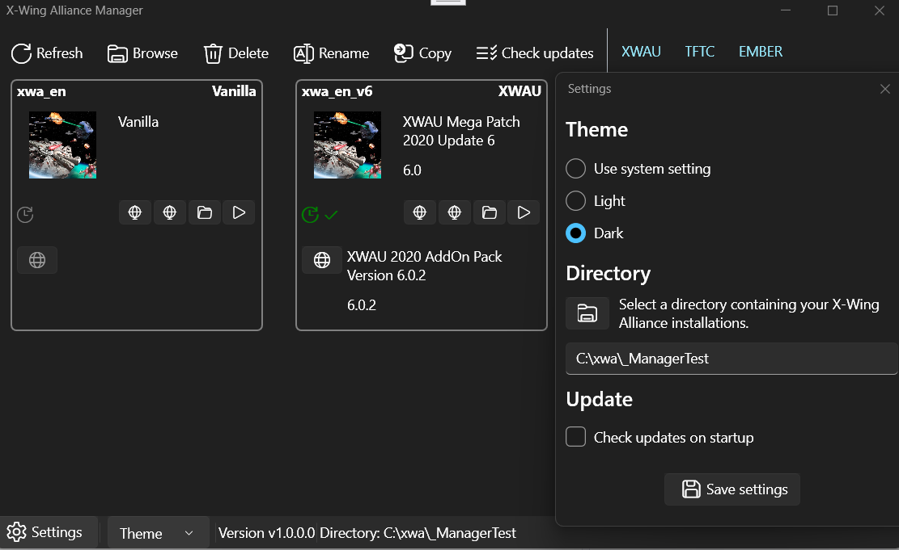

# XwaManager

X-Wing Alliance Manager is a tool to easily manage your XWA installations.

XwaManager runs on Windows 32/64 bits with the .NET framework 4.8.
(Windows 7, Windows 8, Windows 10, Windows 11, or superior)

# Usage

Place the "XwaManager" directory anywhere you want, but not in a XWA installation directory.
Launch "XwaManager.exe".
The tool will ask where is the directory which contain your XWA installations.

# Features

The features of XwaManager are:
- refresh the UI
- list xwa install directories
- copy, rename, delete xwa install directories
- browse xwa directory
- launch install launcher
- open install directory
- show install name and version
- show install icon
- show a checkbox if an update is available
- check for updates button
- check updates at startup setting
- theme setting
- xwa directory setting
- visit xwa mod websites

# Version file

The name of the file is "mod-version-<MAINMOD>-<SUBMOD>.txt".
It contains 6 lines.
Lines 1 to 3 are related to MAINMOD.
Lines 4 to 6 are related to SUBMOD.
For each group of 3 lines:
- line 0 is the version
- line 1 is the full name
- line 2 is a URL to get infos about the mod version

# Check update

To enable the check update feature, add the mod-version file to the install directory.
The local version file is compared to the online version file.

